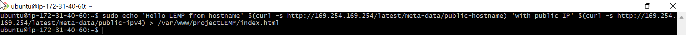

# WEB STACK (LEMP STACK IMPLEMENTATION PROJECT)

**What is LEMP stack ?**

LEMP is an open-source web application stack used to develop web applications. The term LEMP is an acronym that represents L for the Linux Operating system, Nginx (pronounced as engine-x, hence the E in the acronym) web server, M for MySQL database, and P for PHP scripting language.

LEMP Stands For:

L- Linux Operating System

E- Nginx Server

M- MySQL Database

P- PHP

LEMP enjoys good community support and is used around the world in many highly-scaled web applications. Nginx is the second most widely used web server in the world following Apache.


 ## PREREQUISITE (LEMP STACK IMPLEMENTATION)

 - An Aws Free tier account.

 - An Ec2 instance Running on a virtual machine

 - Ubuntu server Os running.

 ## STEP 1

 Launch Git bash and connect to AWS EC2 Instance 

 - Run `cd` command to change directory in to where the ssh key is located

 - Run `ssh -i <Your-private-key.pem> ubuntu@<EC2-Public-IP-address>`

    


## Installing Nginx Web Server

- To install Nginx web server, first update the package manager

    - Run `$ sudo apt update` to update package manager 

        

    - Run `sudo apt install nginx`

       

- To verify if Nginx is successfully installed on Ubuntu 
  
    

    - Stop any webserver runnung on the Terminal, in this case apache2
    
     - Run `sudo service apache2 stop`

     - Run `sudo systemctl restart nginx`

     - Run `sudo systemctl status nginx`


       

- To check if we can access our Server locally using Ubuntu

   - Run `$ curl http://localhost:80 or curl http://127.0.0.1:80`

       

- To test how Nginx respond to request from the internet 

    - Run `http://<Public-IP-Address>:80` on the browser 

        


## Installing MySQL

- To install MySQL-server

    - Run `sudo apt install mysql-server`

        

- To connect Mysql server as the administrative root user 

    - Run `sudo mysql`

        

- Before running a security script that comes with Mysql database to lockdown the system, we   need to create a password first for the root user. we define password as ; `PassWord123#`

- To set root user password 

    - Run `ALTER USER 'root'@'localhost' IDENTIFIED WITH mysql_native_password BY 'PassWord123#'; `

         

- To start interactive script 

    - Run `sudo mysql_secure_installation`

        

- To test if you are able to login into Mysql console

    - Run `sudo mysql -p` and type in password. To exit run `exit`

        


## Installing PHP 

**PhP help to generate code and process dynamic web content for the web server**

Unlike apache2 that has PHP interpreter embeded in each request, Nginx requires an addition program to handle PHP processing and act as a bridge between the PHP interpreter itself and web server

- First you will need to install `php-fpm (php fastCGI process manager)` and ask Nginx to pass request to the software for processing 

- Secondly, install `php mysql`

- To install both program

    - Run `$ sudo apt install php-fpm php-mysql`

    


## Configuring Nginx to use PHP Processor

When using the Nginx web server, we can create server blocks (similar to virtual hosts in Apache) to encapsulate
configuration details and host more than one domain on a single server. we will use `projectLEMP` as an example domain name.

On Ubuntu 20.04, Nginx has one server block enabled by default and is configured to serve documents out of a directory at `/var/www/html` .While this works well for a single site, it can become difficult to manage if you are hosting multiple
sites. Instead of modifying `var/www/html` ,we'll create a directory structure within `/var/www for the your_domain website. leaving /var/www/html` in place as the default directory to be served if a client request does not match any other sites.

- To Create the root web directory for your_domain 

    - Run ` sudo mkdir /var/www/projectLEMP`


    Assign ownership of the directory the $USER enviroment variable,which will reference your current systme user 


    - Run ` sudo chown -R $USER:$USER /var/www/projectLEMP`

        

    - Open a new configuration file in Nginx site-available  directory,using preffered command line editor 

    - Run ` sudo nano /etc/nginx/sites-available/projectLEMP`

        

- paste the following 
    
   
   #/etc/nginx/sites-available/projectLEMP

   
server {
    listen 80;

    server_name projectLEMP www.projectLEMP;

    root /var/www/projectLEMP;

    index index.html index.htm index.php;

    location / {
        try_files $uri $uri/ =404;
    }

    location ~ \.php$ {
        include snippets/fastcgi-php.conf;
        fastcgi_pass unix:/var/run/php/php8.1-fpm.sock;
     }

    location ~ /\.ht {
        deny all;
    }

}
    


 **What each of these directives and location blocks do**:

1. listen- Defines what port NginX will listen on. In this case, it will listen on `port 80` ,the default port for HTTP.

2. root -Defines the document root where the files served by this website ar stored.

3. index - Defines in which order Nginx will prioritize index files for this website. It is a commnon practice to list `index.html` files with a higher precedence than `index.php` files to allow for quickly setting up a maintenance landing page in PHP applications. You can adjust these settings to better suit your application needs.

4. server name - Defines which domain names and/or IP addresses this server block should respond for. Point this directive to your server's domain name or public IP address.

5. location /-The first location block includes a try files directive, which checks for the existence of files or directories matching a URl request. If Nginx cannot find the appropriate resource, it will return a 404 error.

6. location ~ \.php$- This location block handles the actual PHP processing by pointing Nginx to the fastcgi-php.conf configuration file and the php7.4-fpm.sock file , which declares what socket is associated with php-fpm .

7. location ~ /\.ht - The last location block deals with `.htaccess` files, which Nginx does not process. By adding the deny all directive, if `.htaccess` files happen to find their way into the document root ,they will not be served to visitors.

- **To activate configuration by linking to the config file from Nginx `site-enabled` directory**

    - Run ` sudo ln -s /etc/nginx/sites-available/projectLEMP /etc/nginx/sites-enabled/`

This tells Nginx to use this configurtion when next its reloaded

- To test for configuration syntax error 

    - Run `sudo nginx -t`

        

- To disable Nginx host that is currently configured to listen on `Port 80`

    - Run `sudo unlink /etc/nginx/sites-enabled/default`

    - Reload Nginx by `sudo systemctl reload nginx`

        


- To test that the new server blocker works as expected,we need to create an index.html file in the web root `/var/www/projectLEMP` since it was empty although active.

    - Run `sudo echo 'Hello LEMP from hostname' $(curl -s http://169.254.169.254/latest/meta-data/public-hostname) 'with public IP' $(curl -s http://169.254.169.254/latest/meta-data/public-ipv4) > /var/www/projectLEMP/index.html`


        

    - Run `http://<Public-IP-Address>:80` on browser to open website using Ip address

        


## Testing PHP with Nginx

- To test if Nginx can correctly hand `.php` off to the PHP processor

- Create a test PHP file calle `info.php` within your Document root foldr

    - Run `nano /var/www/projectLEMP/info.php` to create a `info.php` file

         

Paste the following lines in the new file,this is a valid PHP code that will return an information about your server.

- Run 

 `<?php
 
phpinfo();`


- To access the webpage from the browser using the Domain name or Ip address followed by `/info.php`

    - Run `http://`server_domain_or_IP`/info.php`

    - i.e `http://3.90.32.140/info.php`

        


- To remove PHP page because it contains sensitive information 

    - Run ` sudo rm /var/www/projectLEMP/info.php`

    - Run `ls /var/www/projectLEMP/` to check if the file has been removed successfully 

        

## Retrieving data from Mysql Database using PHP

- To accomplish this task, we will create a database with a "simple To do list"  and configure it so that Nginx Server can get access and be able to query the data from the data base.

- We will need to create a new user with the `mysql_native_password` in order for us to be to connect Mysql database from PHP


- We will also create a database name called `Lemp_user` 

- To Connect to the Mysql Console Run `sudo mysql`

    


- To create a database name called `Lemp_database`

   - Run `mysql> CREATE DATABASE `Lemp_database`;`


        


- To create a new user and grant him Mysql native_password 

    - Run `mysql>  CREATE USER 'Lemp_user'@'%' IDENTIFIED WITH mysql_native_password BY 'Orahachi123#';`

        

- To give permission to the user over the database

    - Run `mysql> GRANT ALL ON Lemp_database.* TO 'Lemp_user'@'%';`

        

This gives the Lemp_user permission on the Lemp_database, and preventing the user from creating or modifying any other database on your server.

- To exit Mysql Run `mysql> exit`

    


- To test if the user has proper permission by logging in to the Mysql management console using the custom user credentials 

    - Run `$ mysql -u Lemp_user -p`

        


- To confirm if Lemp_user has access to the Lemp_database

    - Run `mysql> SHOW DATABASES;`

        


- To create a test table todo_list on the Mysql management console

    - Run `CREATE TABLE Lemp_database.todo_list (item_id INT AUTO_INCREMENT,content VARCHAR(255),PRIMARY KEY(item_id));`

        

- To insert a few roles content into the mysql test table

    - Run `mysql> INSERT INTO Lemp_database.todo_list (content) VALUES ("My first important item");`

    - Run `mysql> INSERT INTO Lemp_database.todo_list (content) VALUES ("My second important item");`

    - Run `mysql> INSERT INTO Lemp_database.todo_list (content) VALUES ("My third important item");`

    - Run `mysql> INSERT INTO Lemp_database.todo_list (content) VALUES ("My last important item");`

        

- To confirm if the content is successfully saved into the table 

     - Run `mysql>  SELECT * FROM Lemp_database.todo_list;`

        

- To exit Mysql management console 

     - Run ` exit `

        


- To create a PHP script that will connect with the Mysql database and query for your content .
create a php file in your `custom web root directory ` using `nano editor`

- Run `$ nano /var/www/projectLEMP/todo_list.php`

    

 write the following content into `todo_list.php` file

  - Run 
 ```<?php
$user = "Lemp_user";
$password = "*****";
$database = "Lemp_database";
$table = "todo_list";

try {
  $db = new PDO("mysql:host=localhost;dbname=$database", $user, $password);
  echo "<h2>TODO</h2><ol>";
  foreach($db->query("SELECT content FROM $table") as $row) {
    echo "<li>" . $row['content'] . "</li>";
  }
  echo "</ol>";
} catch (PDOException $e) {
    print "Error!: " . $e->getMessage() . "<br/>";
    die();
}
```


- To access the web page and view the content in browser

    - Run `http://<Public_domain_or_IP>/todo_list.php`

    - Run `http://3.81.205.140/todo_list.php` on browser


        

## End Of Lemp stack project


    


 


    


