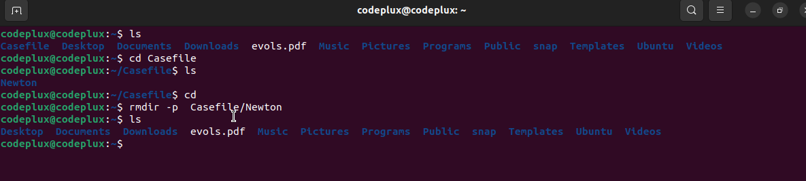
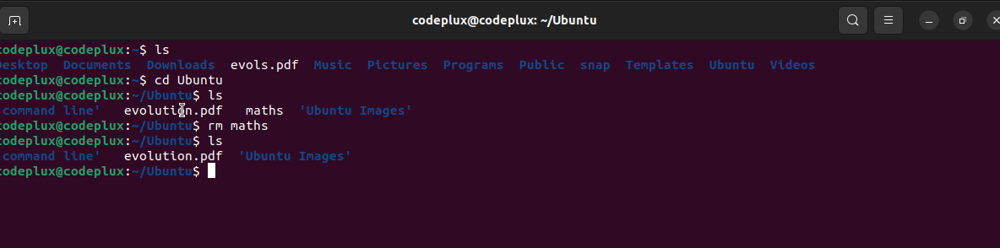

 # LINUX COMMAND PROJECT
 
 ## Prequisite :
 - Ubuntu destop distribution installed
 - Local machine or web 

 ## File Manupulation

 1. **Create a `sudo` command(superuser do)**

    Functions: require to peform task that requires administrative or root permission.

    
    - Run `sudo apt upgrade` to upgrade the latest version of Ubuntu.
   
    

2. **Create `pwd` command**
   
    Functions: required to find the path for the current/present working directory

   
    - Run `pwd` to determine the present working directory

    - Run `pwd -p` to print  the actual path of the working directory 

    - Run `pwd -L` to print  enviroment variable content, including symbolic links
     

3. **Create `cd` command**

    Functions: required to Navigate through a Linus file or directory,depending on the current working directory, it requires the full path or the file name.

     The current working directory is  codeplux@codoplus:~/Programs 

    - Run `cd` to change the working directory 

    - or Run `cd Ubuntu` to switch the directory path 
    

 4. **Create `ls` command**

    Functions: required to list the item in a directory or list the content.

    The current working directory is  codeplux@codoplus:~/Programs

    - Run `ls` to view or list the content of the directory
    

    - Run `ls -R` to list all files in the sub-directories

    - Run `ls -a` to show all hiddens files in addition to the visible ones

    - Run `ls -lh` to show the files sizes in a easy readable formats such as MB,GB and TB
    -

5.  **Create `cat` command (Concatenate)**   

    Functions: required to list,combines and file content to the standard ouput

    The current working directory is codeplux@codoplus:~/Downloads
    
    - Run `cat (filename.extension)`

    - i.e `cat evolution.pdf` 
    

6. `cp evolution.pdf /home/codeplux/Documents)`

    Functions : requires to copy file, directories and their content 

    **To copy file from** codeplux@codoplus:~$ into codeplux@codoplus:~/Documents

   - Run `cp file.name.extension /filepath)`

    - i.e `cp evolution.pdf /home/codeplux/Documents`

    

    **To copy files from** a codeplux@codoplus:~$ into codeplux@codoplus:~/Ubuntu

   - Run `cp (filename.extention) (filename.extension) /Filepath`

    - i.e  `cp evolution.pdf maths /home/codeplux/Ubuntu`
    

    **To copy an entire directory into another directory**

    - Run `cp -R /(Source file path) /(destination file path)`
    
    - i.e `cp -R /home/codeplux/Ubuntu /home/codeplux/Documents`
    
    

7.  **Create `mv` command** 

    Function : Required to move and rename file and directories

    - Run `mv filename /filepath`

    - i.e `mv maths /home/codeplux/Ubuntu`
    

    *To rename a file**

    - Run `mv filename new filename`

    - i.e `mv evolution.pdf evols`
    

8.  **Create `mkdir` command**

    Functions : Required to make a new directory or directories
 
    - Run `mkdir (directory name)`
    
    - i.e `mkdir Casefile`
    

    *To make a nested directory*

    - Run `mkdir (directory name/nested directory)`

    - i.e  `mkdir Casefile/Newton`
    

9.   **Create `rmdir` command**

     Functions : Required to remove or delete a directory

     - Run `rmdir -p filepath`

     - i.e `rmdir -p Casefile/Newton`
     

10.  **Create `rm` command**

     Funtions : Required to remove a file within a directory

     - Run `rm filename`

     - i.e `rm maths`
    
    
     **To remove multiply files within a directory**

     - Run `rm filename filename`

     - i.e `rm Python Java`  from Progrms
     

11.  **Create `touch` command**

     Functions : Required to create an empty file 

     - Run `touch sqlite_command.sh`
     

12. **Create `locate` command**

    Funtions : To locate or find a file in data base system.

    - Run ` locate maths` to find maths in the database
    

13. **Create `find` command**

    Function : To find files within a specific directory

    - Run ` find [option][path][expression]`
    
    - i.e `find /home -name maths` to find maths within the directory 'home'

    

14. **Create `grep` command**

    Funtion : Required to find a word by searching through all the words in a specific file.

     - Run `grep devops maths`

     Results : Displays line that contains the 'devops' in the file 'maths'

15. **Create `df` command**

    Functions : Required to determine system disk space usage.

    To determine current disk usage 

    - Run `df -h`

    

16.  **Create `du` command**

     Function: required to determine how much space a specific file or directory takes up 

      - Run `du /home/codeplux/Documents`

      - Run `du -s /home/codeplux/Documents` for  total size of the specific folder

      - Run `du -m /home/codeplux/Documents` for information of folder in MB

     

17. **Create `head` command**

    Funtions : Required to view the first 10 lines of a file in a present working directory

    - Run `head evolution.pdf` to view the first 10 lines in the 'evolution.pdf'
    

18.  **Create `tail` command**

      Funcions : Required to view the last 10  lines of a file.

       - Run `tail [-n] [file]` to view the last 10 lines

       - i.e `tail -n evolution.pdf`

        

19.  **Create `diff` command**

     Funtions : Required to find the difference between two files

     - Run `diff filename filename`

     -i.e `diff evols.pdf maths` to determine if the two files differ.
    

20.  **Create `tar` command**

     Functions : Required to archive multiple file into 'Tar' format

      - Run `tar -cvf newarchive.tar home/codeplux/Ubuntu` 
      

     ## FILE PERMISSION 

21.  **Create `chmod` command**

      Functions : Required to modify a file or directory's read , write or execute permisssions

       - Run ` chmod 777 maths.sh` to modify the permission for maths.sh 

        

22. **Create `chown` command**

    Functions : Required to change the ownership of a file ,directory or symbolic link to a specific username

    - Run ` chown [username] [filename]` to change the file ownership to another user.
    
    - i.e `chown codeplux2 maths` to change maths ownership from codeplux to codeplux2

    *To determine the ownership of the file*

    - Run `ls -l`
    

23. **Create `jobs` command**

    Functions : Required to display all running process along with their ID 

    - Run `job job ID`

24. **Create `kill` command**

    Function : required to kill all responsive programs manually 

    To Kill a program you must have the program identification Nunmber(PID)

    - Run `ps ux` to get the program Identification
    

    -Run `kill PID `to  terminate a program 
    
    -Run `Kill SIGTERM PID` to terminate a program and save.

    -Run `KILL SIGKILL PID` to terminate a program without saving.
    

25. **Create `ping` command**

    Function : Required to check whether a network or server is reachable

    - Run `ping [host_name or IP_Address]`

    - i.e `ping google.com` to chech whether google is reacheable
    

26.  **Create `wget` command**

     Funtion : Required to download a file from the internet with stopping hindering any running process

     - Run `wget [url]` to downland files directory

     - i.e `wget https://wordpress.org/latest.zip`to download a file on evolution
    

27. **Create `uname` command**

    Function : Required to give information about linux system and hardware 

    - Run `uname -a`to determe all system information

    - Run `uname -s` to determine kernel name

    - Run `uname -n` to determine system node host
     

28. **Create `top` command**

    Function : Required to display all running system process and a dynamic real time view of the current system 

    - Run `top`
    

29. **Create `history` command**

    Function : Required to display to over 500 previosuly displayed command.

    - Run `history`
    

30. **Create `man` command**

    Function : Required to provide user manual for any command or utility you can run in the Terminal 

    - Run `man [command name]`
    
    - i.e `man ls` to find user manual for the command 'ls'
    

31. **Create `echo` command**

    Function : Required to display a line of text or string using standard output

    for R= readme
    - Run `echo R`

32. **Create `zip and unzip` command**

    Functions : Required to compress files into zip format

    - Run `zip latestest.zip Sqlite_commands.sh` to archive Sqlite_commands.sh intp zip format

     *To unzip latest.zip*

     - Run `unzip latest.zip`
      

33.  **Create `hostname` command**

     Funtions : Required to know system hostname.

      - Run `hostname [options]`
      

34. **Create `useradd userdel` command**

    Functions : Required to create user or delete user

    - Run `useradd prince` to create a user called 'prince'

    - Run `userdel prince ` to delete a user called 'prince'
    

35. **Create `apt-get ` command**

    Functions : Required to handle Advanced Package Tool(APT) librarie in Linux

    - Run ` apt get [commad]`
    

36. **Create `nano, vi, jed ` command**

    Functions : Required to edit and manage file via text editor

    - Run `nano maths`
    

    - Run `vi maths`
    

37. **Create `alias unalias ` command**

    Functions : Required to create a shortcut with the same funcationality as command,file name or text

    - Run `alias Name=String`

    - i.e `alias k=kill` to equate k=kill
    

38.  **Create `su ` command**

      Functions : Required to run a programme as a different user

       - Run `su [username]`

       - i.e `su codeplux2` to switch user 
       

39. **Create `htop` command**

    Function : Required to monitor system resources and server process  real-time 

    - Run `htop`
    

40.  **Create `ps` command**

      Functions : Required to produce snapshots of all running process in the system.

       - Run `ps`
    

    

