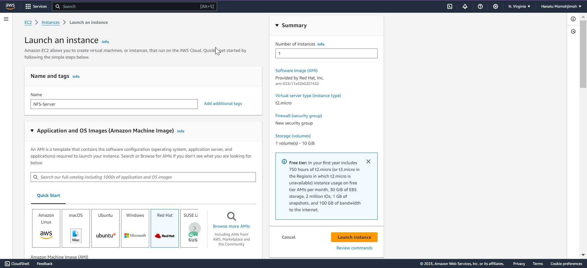
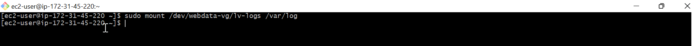
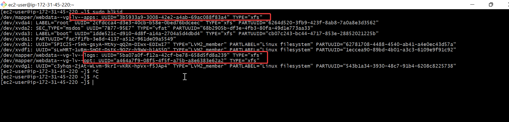
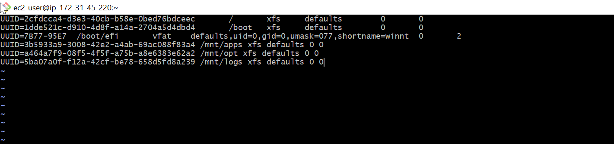
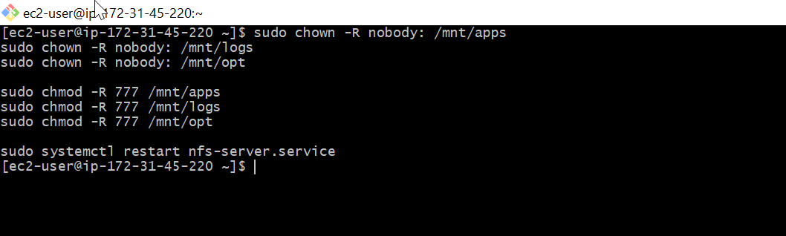
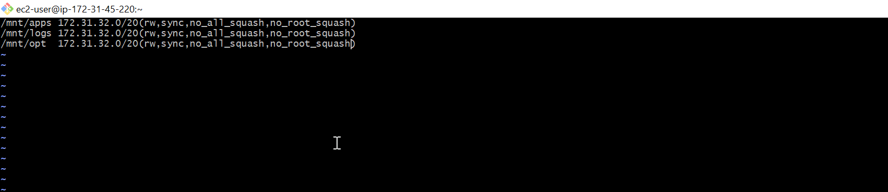
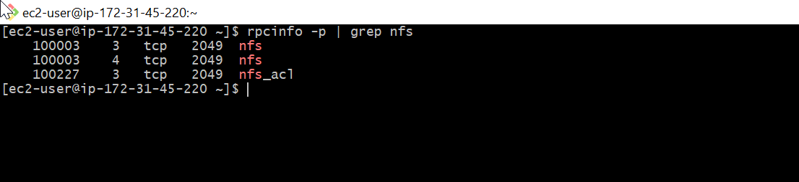
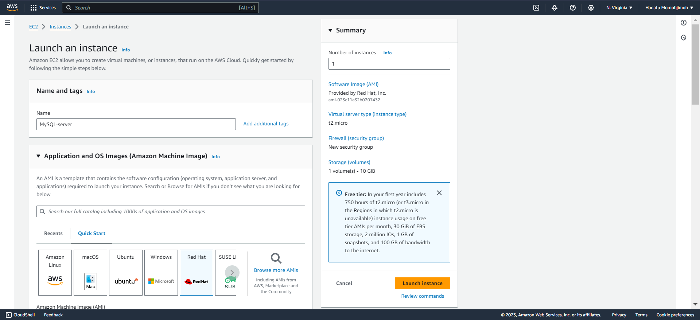

# Devops Tools and Website Solutions

## Aim 

To implement a Devops tools that can help maintain Daily activities on our wordpress websites

### Perequisite
- Infrastructure : Aws
- Webserver Linux: Red hat Enterprise 8
- Data server : Ubuntu + MYSQL
- Storage server : Red hat + NFS
- programming language : PHP
- Code reprository : Gihub

# Implementing a Business Website Using  NFS for the backend storage 

- Step-1
- Spin up an EC2 with Red Hat OS



- To install the `lvm2` package
    - Run `sudo yum install lvm2`


- To create 3-logic Volumes `lv-opt`, `lv-apps` and `lv-logs`

    - Run `sudo lvcreate -n apps-lv -L 9G webdata-vg`
        `sudo lvcreate -n logs-lv -L 9G webdata-vg`
        `sudo lvcreate -n opt-lv -L 9G webdata-vg`

    

- To format the logical Volumes with `xfs` file system using `mkfs.xfs`

 - Run `sudo mkfs -t xfs /dev/webdata-vg/lv-apps`
 -  Run `sudo mkfs -t xfs /dev/webdata-vg/lv-opt`
 -  Run `sudo mkfs -t xfs /dev/webdata-vg/lv-logs`

    

- To Create a mount point on `/mnt` directory for the logical volume as follow 

- Run `sudo mkdir -p /mnt/apps` for webservers Mount
- Run `sudo mkdir -p /mnt/logs` to be used by webserver logs 
- Run `sudo mkdir -p /mnt/opt` to be used by jekin server 

- To mount `/mnt/apps` on `lv-apps` logical volume

    -  Run `sudo mount /dev/webdata-vg/lv-apps /mnt/apps`

- To mount `/mnt/logs` on `lv-logs`

    - Run `sudo mount /dev/webdata-vg/logs-lv /mnt/logs`

- To mount `/mnt/opt` on `lv-opt`
     - Run `sudo mount /dev/webdata-vg/lv-opt /mnt/opt`

    

- Use rsync utility to backup all the files in the log directory `/var/log` into `/mnt/logs` (This is required before mounting the file system).

- Run `sudo rsync -av /var/log/. /mnt/logs`
    

- To Mount /var/log on logs-lv logical volume. (Note that all the existing data on /var/log will be deleted).

    - Run `sudo mount /dev/webdata-vg/lv-logs /var/log`
    

- To Restore log files back into `/var/log` directory.


-To  Update `/etc/fstab` file so that the mount configuration will persist after restarting the server. The UUID of the device will be used to update the `/etc/fstab` file. Run the command shown below to get the UUID of the `lv-apps`, `lv-logs` and `lv-opt` logical volumes:

- Run `sudo blkid`
- apps: UUID=a954622b-680d-4ee8-b491-8f097e2eef8c /mnt/apps xfs defaults 0 0
- opt:  UUID=281fb684-4977-44ac-b75c-6b77702cc750 /mnt/opt xfs defaults 0 0
- logs: UUID=8402a049-f932-4031-9044-d11591ca24f0 /mnt/logs xfs defaults 0 0
    

- Update `/etc/fstab` in this format using your own UUID and remember to remove the leading and ending quotes.

    - Run `sudo vi /etc/fstab`

    
- To Test the configuration, Run `sudo mount -a`

    

- To Reload the daemon , Run `sudo systemctl daemon-reload`
    


- To verify the set up 
    - Run `df -h` after relaoding the Deamon using ``sudo mount -a` and `sudo systemctl daemon-reload`

    

## Installing NFS-Server 

- To install NFS server 
    - Run 
```
sudo yum -y update
sudo yum install nfs-utils -y
sudo systemctl start nfs-server.service
sudo systemctl enable nfs-server.service
sudo systemctl status nfs-server.service
```


- Export the mount for webserver `subnet cidr` to connect as clients. For simplicity, you will install the three webservers inside the subnet, but in production set up you would probably want to seperate each tier inside its own subnet for higher level of security.

- TO check your `subnet cidr`- Open your EC2 details in AWS web console and locate Networking tab and open a subnet link.


- To make sure we set up a permission that will allow our webservers read, write and execute files on NFS Server

    - Run 
```
sudo chown -R nobody: /mnt/apps
sudo chown -R nobody: /mnt/logs
sudo chown -R nobody: /mnt/opt

sudo chmod -R 777 /mnt/apps
sudo chmod -R 777 /mnt/logs
sudo chmod -R 777 /mnt/opt

sudo systemctl restart nfs-server.service
```



- To configure access to NFS for clients within the same subnets

    - Run 
```
sudo vi /etc/exports

/mnt/apps 172.31.32.0/20(rw,sync,no_all_squash,no_root_squash)
/mnt/logs 172.31.32.0/20(rw,sync,no_all_squash,no_root_squash)
/mnt/opt  172.31.32.0/20(rw,sync,no_all_squash,no_root_squash)

Esc + :wq!

sudo exportfs -arv
```



- To export Run ` sudo exportfs -arv`


- To check which port is used by NFS server and open it using security groups 

    - Run `rpcinfo -p | grep nfs`

    

- In order for NFS server to be accessible from your client , you must also open following ports ;
- TCP 111
- UDP 111
- UDP 2049


##  Configuring Backend Database.
- Launch an EC2 instance named `MySQL-server` to serve as Datbase




 - Update the reprository using `sudo yum -y update`

 - To update and Install `mysql-server`

    - Run
```
sudo yum update
sudo yum install mysql-server
```


- To create a database name `tooling` and database user `webaccess` with password ; `mypass1` to use only the `subnet cidr`

- Run
```
sudo mysql
CREATE DATABASE tooling;
CREATE USER `webaccess`@`172.31.32.0/20` IDENTIFIED BY 'mypass1';
GRANT ALL ON tooling.* TO 'webaccess'@'172.31.32.0/20';
FLUSH PRIVILEGES;
SHOW DATABASES;
exit
```


## Preparing the Webservers 

we need to make sure that our webservers can serve the same content from the shared storage solutions, in our case NFS server and MySql database. You already know that one DB can be accessed for reads and writes by multiple clients.For storing shared files that our webservers willuse- we utilize NFS and ount previously created logical Volume `Lv-apps` to the folder where Apache stores files to be served to the users (`/var/www`)

This approach will make our Webserver `stateless`, which means we will bw ablw to add new ones or remove them whenever we need, and the intergrity of the data(in the database and on NFS) will be preserved.


- To configure NFS client(this step must be done on all three servers)
- Deploy a Tooling application to our web servers into a shared NFS Folder
- To configure the web-server to work with a single MySQL database.

- To Install NFS Client 
    

- Run `sudo yum install nfs-utils nfs4-acl-tools -y`

 

- To Mount `/var/www/` and target the NFS server's export for apps

- Run 
```
sudo mkdir /var/www
sudo mount -t nfs -o rw,nosuid <NFS-Server-Private-IP-Address>:/mnt/apps /var/www

```

sudo mkdir /var/www
sudo mount -t nfs -o rw,nosuid 172.31.44.217:/mnt/apps /var/www
sudo mount -t nfs -o rw,nosuid 172.31.44.217:/mnt/logs /var/log

