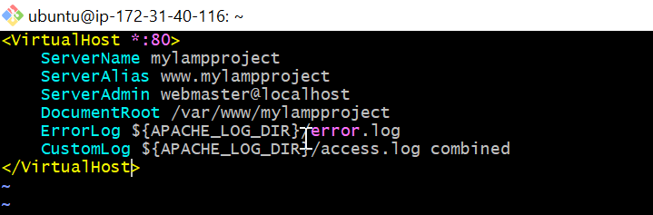
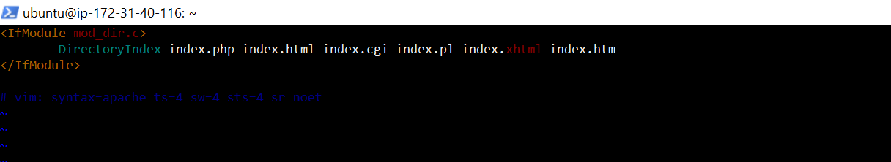
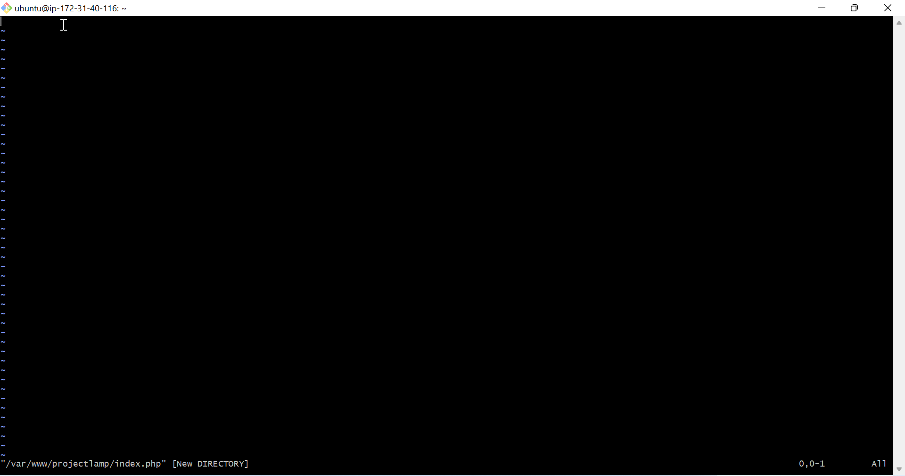
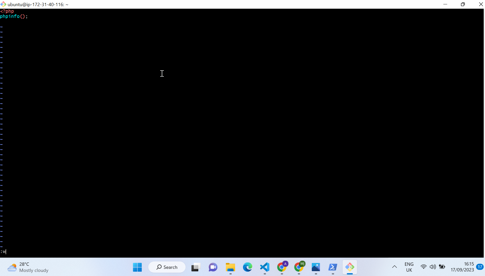

# LAMPSTACK IMPLEMENTATION PROJECT
 
 **What is Lampstack?**

 A LAMP stack is a bundle of four different software technologies that developers use to build websites and web applications. LAMP is an acronym for the operating system, Linux; the web server, Apache; the database server, MySQL; and the programming language, PHP. All four of these technologies are open source, which means they are community maintained and freely available for anyone to use. Developers use LAMP stacks to create, host, and maintain web content. It is a popular solution that powers many of the websites you commonly use today.

 **What is a Stack?**

 A technological stack is a set of frameworks, libraries and tools used to develop a Software Application. These include : LAMP STACK, LEMP STACK, MEAN STACK AND MERN STACK.

 ## PREREQUISITE (LAMP STACK IMPLEMENTATION)

 - An Aws Free tier account.

 - An Ec2 instance Running on a virtual machine

 - Ubuntu server Os running.

 ## AWS Account set up 

 - Register or open a new AWS account 

 

 - Create an access key and name e.g Project3-key
   
   this will be downloaded automatically

   

## Connecting to Aws Instance 

- Click on the Instance name and also click on connect on the Aws management Console

    

- Connecting AWS virtual machine to local Machine via SSh protocol

    

- Open the windows Terminal and run the following commands
 
    Run `cd Downloads`

    

- To connect to the EC2 Instance 

     Run `ssh -i <"access key"> ubuntu@<public ip address>`

     i.e `ssh -i "Project3-key" ubuntu@3.81.216.176`

     

# Installing Apache and Updating the Firewalls

**Apache**

Apache is an open-source web server that forms the second layer of the LAMP stack. The Apache module stores website files and exchanges information with a browser using HTTP, an internet protocol for transferring website information in plain text. For example, when a browser requests a webpage, the Apache HTTP server does the following: Receives the request,
Processes the request and finds the required page file and Sends the relevant information back to the browser

- To install Appache using Ubuntu package manager "apt"

    #update a list of packages in package manager

    - Run `sudo apt update`

        

    #run apache2 package installation

    - Run `sudo apt install apache2`

         

- To verify that Apache2 is running on our OS system

    - Run `sudo systemctl status apache2`

        

- To Receive Traffic from web server 

   - Open TCP port 80 i.e the default web port for web browswers to access a web page 

        

- To access Apache server via local machine 

   - Run `curl http://localhost:80`

            

      or  `curl http://127.0.0.1:80`

        

- To Know How Apache Http server Respond to Request from the internet

  - Run `http://<Public-IP-Address>:80` 

  - i.e `http://3.81.216.176:80`

    

- To retrieve IP address without visiting the Aws management console
  
  `Run curl -s http://169.254.169.254/latest/meta-data/public-ipv4`

    

# Installing Mysql

**MySQL**

MySQL is an open-source relational database management system and is the third layer of the LAMP stack. The LAMP model uses MySQL for storing, managing, and querying information in relational databases. For example, developers store application data, such as customer records, sales, and inventories. When a user
 searches for information, the web server queries the stored data in MySQL. Query refers to special instructions for manipulating data in a relational database with the SQL language.

- To instal Mysql database server

   -  Run `sudo apt install mysql-server`

    

- To login into Mysql console

   - Run `sudo mysql`

    

- To set Password for the Root user

   - Run `ALTER USER 'root'@'localhost' IDENTIFIED WITH mysql_native_password BY 'PassWord.1';`

        

- To exit Mysql shell

   - Run `exit`

        

## Start interactive script.

- To start interactive script

   - Run `sudo mysql_secure_installation`

        

- To Confirm password for Mysql root user and change anonymous user

   - click y/ any other letter

        

        

- To Test log into Mysql using `sudo mysql -p`

    

# Installing PHP

 **PHP**

    PHP, which stands for PHP: Hypertext Preprocessor, is the fourth and final layer of the LAMP stack. It is a scripting language that allows websites to run dynamic processes. A dynamic process involves information in software that constantly changes. Web developers embed the PHP programming language in HTML to show real-time or updated information on websites. They use PHP to allow the web server, database, and operating system to cohesively process requests from browsers. 
     
**Prerequisite** ;
 
    1. Install PHP-MYSQL to allow php communicate with mysql
    2. Install libapache2-mod-php to enable apache haandle php files
    3. Intall PHP packages with its dependecies

- To install the php-mysql, libapache2-mod-php and php package

    - Run `sudo apt install php libapache2-mod-php php-mysql`

        

- To confirm PHP version 

    - Run `php -v`

        

# Creating a Virtual Host for Your website Using Apache

- To make a domain named `mylampproject`

    - Run `sudo mkdir /var/www/mylampproject`

      

- To assign User to `mylampproject`

    - Run `sudo chown -R $USER:$USER /var/www/mylampproject`

      

- To create a file in the Apache's site Available directory

    - Run `sudo vi /etc/apache2/sites-available/mylampproject.conf`

    - Add the following file to the Blank file displayed

      <VirtualHost *:80>

      `ServerName mylampproject`

      `ServerAlias www.mylampproject`

      `ServerAdmin webmaster@localhost`

      `DocumentRoot /var/www/mylampproject`

      `ErrorLog ${APACHE_LOG_DIR}/error.log`

      `CustomLog ${APACHE_LOG_DIR}/access.log combined` 
    
      </VirtualHost > 

      

- To show the new files in site available Directory

    - Run `sudo ls /etc/apache2/sites-available`

     You will see something like this

     `000-default.conf  default-ssl.conf  mylampproject.conf`

      

- To enable New virtual host

     - Run ` sudo a2ensite mylampproject`

    

- To disable apache2 default page and stop it from overriding virtual host 

    - Run `sudo a2dissite 000-default` and reload apache using `sudo systemctl reload apache2`

        

- To create a html file in the web root directory `/var/www/mylampproject` to test if the   virtual host work as expected

    - Run `sudo echo 'Hello LAMP from hostname' $(curl -s http://169.254.169.254/latest/meta-data/public-hostname) 'with public IP' $(curl -s http://169.254.169.254/latest/meta-data/public-ipv4) > /var/www/mylampproject/index.html`

        

# Enable PHP on Website

The Default Directory setting on Apache, will awlways take precedence of `index.html` over `index.php`. 

- To Change this behavior you will nead to change `/etc/apache2/mods-enabled/dir.conf`

- To change the order in which index.php file is listed within the DirectoryIndex derivative

    - Run `sudo vim /etc/apache2/mods-enabled/dir.conf`

    

   - Run `<IfModule mod_dir.c>
        #Change this:
        #DirectoryIndex index.html index.cgi index.pl index.php index.xhtml index.htm
        #To this:
        DirectoryIndex index.php index.html index.cgi index.pl index.xhtml index.htm
        </IfModule>`

     
    
- To relaod apache2 to effect changes

    - Run `sudo systemctl reload apache2`

      

- To create a PHP script to test if PHP is correctly installed in your server
   
     Create a new file named `index.php`

    - Run ` vim /var/www/mylampproject/index.php`

       

- Add this text 

              <?php

              phpinfo(); into the blank file and save 

     

- Reload apache server

  

- To remove the PHP page to avoid losing sensitive datas 

  - Run  ` sudo rm /var/www/projectlamp/index.php`

      

      # End of project

   

    

-

  

