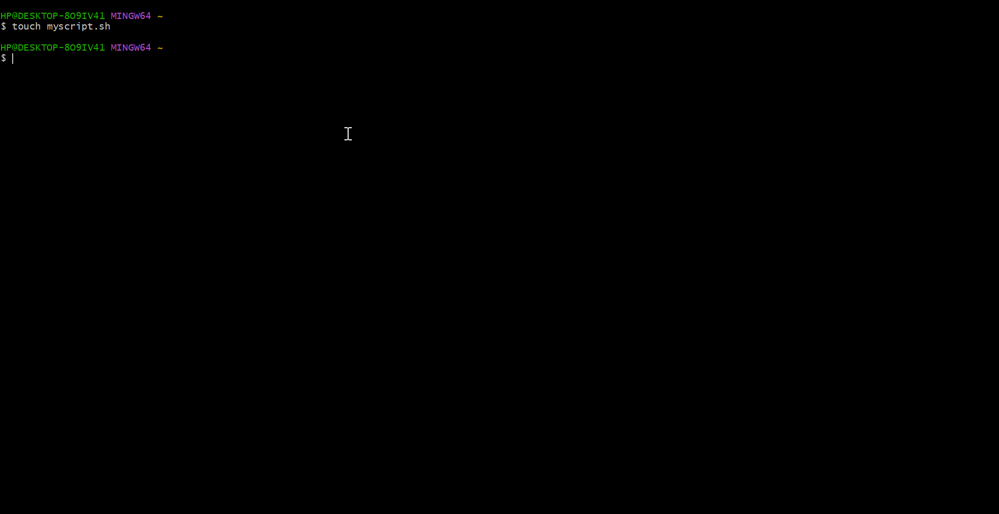
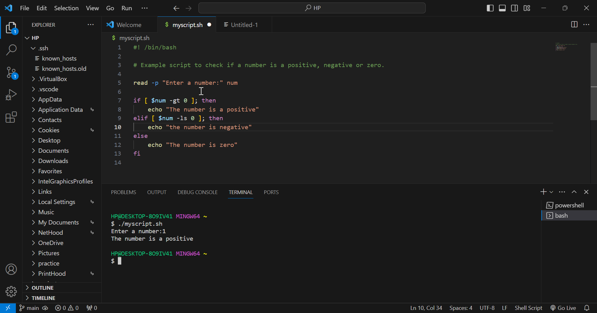
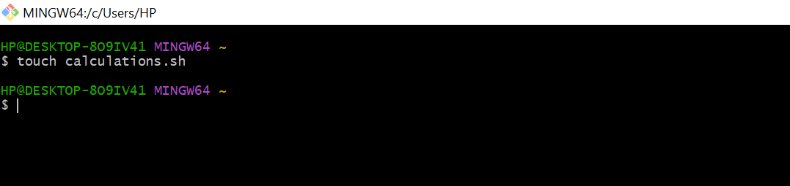
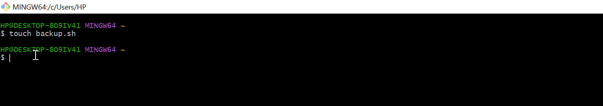

# INTRODUCTION TO SHELL SCRIPTING AND USER INPUT

## What is a shell?

A shell is a special user program that provides an interface for the user to use operating system services. Shell accepts human-readable commands from users and converts them into something which the kernel can understand. It is a command language interpreter that executes commands read from input devices such as keyboards or from files. The shell gets started when the user logs in or starts the terminal


### What is shell scripting 

Shell Scripting

Usually, shells are interactive, which means they accept commands as input from users and execute them. However, sometimes we want to execute a bunch of commands routinely, so we have to type in all commands each time in the terminal.

As a shell can also take commands as input from file, we can write these commands in a file and can execute them in shell to avoid this repetitive work. These files are called Shell Scripts or Shell Programs. Shell scripts are similar to the batch file in MS-DOS. Each shell script is saved with `.sh` file extension e.g., myscript.sh.

A shell script has syntax just like any other programming language. If you have any prior experience with any programming language like Python, C/C++ etc. It would be very easy to get started with it.

A shell script comprises the following elements –

Shell Keywords – if, else, break etc.

Shell commands – cd, ls, echo, pwd, touch etc.

Functions : 

Control flow – if..then..else, case and shell loops etc.


### Shell Scripting Snyntax Elements 

Variables : Bash allows you define work  and work with variables.

Variable can store data of various type such as numbers, string, and array. You can assign values to variables using operators(=).And access their values using variable name preceded by a $ Sign.


- To create an a default shell script

    - Run `touch myscript.sh`

     

- To view the myscript.sh file 

    - Run `ls myscript.sh ` and open with a code editor running ` code . `

    


- To create an executable file of the myscript.sh file 

    - Run `chmod +x myscript.sh`

    And to run the myscript.sh file

    - Run `./myscript.sh `

        


- To proceed with the script we start with a declaration`#! /bin/bash`


- To assign values to variable e.g 

 - Run `name='john' ` and save the file 

 - Retrieving the value `Run echo $name`

    


**Control Flow statement**

 Bash provides a control flow statement like if-else, for loops, while loops and case statement to control the flow of execution in your scripts. These statements allows you to make a decision,iterates over lists, and execute different commands based on conditions.

 - Using `if-else` to execute script based on Condition 

 - Run 
 
 ```
 
 #!/bin/bash

# Example script to check if a number is positive, negative, or zero

read -p "Enter a number: " num

if [ $num -gt 0 ]; then
    echo "The number is positive."
elif [ $num -lt 0 ]; then
    echo "The number is negative."
else
    echo "The number is zero."
fi

```



**Iterating through a listing using a loop**

- To list all the number from 1-5 

- Run 
```#!/bin/bash

# Example script to print numbers from 1 to 5 using a for loop

for (( i=1; i<=5; i++ ))
do
    echo $i
done
```


**Command line subtitution** : Allow you to capture the output of a command and use it as a value within your script. you can use the backtick or $()syntax for command subtitution.

- To print current date using the backtick .

  - Run 

  ```#! /bin/bash

    # Using backtick for command line subtitution 

    current_date=`date +%Y-%m-%d`

    echo $current_date
   ```
    

- To print current date using `$()`

 - Run 

  ```
  #! /bin/bash

  # Using backtick for command line subtitution 

    current_date=$(date +%Y-%m-%d)
    echo $current_date
  ```
  .png>)

  **INPUT AND OUTPUT**

   Bash provides various ways to handle inputs and Output. ,you can use the read command to accept user input,and output text through the console using the echo command. Additionally you can redict input and output using operators

   - > to ouput to a file
   - < to input from a file
   - | to pipe the output of one into the input of another 

- To accept user input e.g 

    - Run 
    ```
    echo "Enter your name:"
    read name

    ```

    

- To output Text to Terminal e.g

  - Run `echo "my name is Abdulsamad`

    

- To output the result of a command line into a file 

 - Run `echo "Hello world" index.txt`

    

- To pass the content of a file as input to a command 

    - Run `grep "w" < index.txt`

        

- To pass the result of a command as input to another command 

   - Run `echo "hello world" | grep "pattern"`

    

**Functions**

Bash allows you to define and use functions to group related commands together.functions provides a way to modularize your code and make it more reusable. you can define function using the function keyword or simply by declaring the function name followed by parenthesis.

- To Define a function to greet user 

    - Run 
```#!/bin/bash

# Define a function to greet the user
greet() {
    echo "Hello, $1! Nice to meet you."
}

# Call the greet function and pass the name as an argument
greet "John"

```


## Writing a shell script

- Make a folder called *shell-scripting* where all the files will be kept 

    - Run `mkdir shell-scripting`

- create a file called *user-input.sh*

    - Run `touch user-input.sh`

    

- Open *user-input.sh* file with a code editor and paste the following code and save 

    - paste
```#!/bin/bash

# Prompt the user for their name
echo "Enter your name:"
read name

# Display a greeting with the entered name
echo "Hello, $name! Nice to meet you."

 ```

 


 - Change the file permission to an executable file

    - Run `chmod +x user-input.sh`

    

- To run the script, Run `./user-input.sh`

    


## Directory Manipulation and Navigation 
 
 To write a script that will display the current directory, create a new directory called "my_directory"change to that directory, create two new files inside it, list the files and move back one level up,remove the "my_directory"
 and its contents and finally list the file in the current directory.

- Open a file called *navigating-linux-filesystem.sh*

    - Run `touch navigating-linux-filesystem.sh`

    

    - Open file with code editor paste the following code and save 

```#!/bin/bash

# Display current directory
echo "Current directory: $PWD"

# Create a new directory
echo "Creating a new directory..."
mkdir my_directory
echo "New directory created."

# Change to the new directory
echo "Changing to the new directory..."
cd my_directory
echo "Current directory: $PWD"

# Create some files
echo "Creating files..."
touch file1.txt
touch file2.txt
echo "Files created."

# List the files in the current directory
echo "Files in the current directory:"
ls

# Move one level up
echo "Moving one level up..."
cd ..
echo "Current directory: $PWD"

# Remove the new directory and its contents
echo "Removing the new directory..."
rm -rf my_directory
echo "Directory removed."

# List the files in the current directory again
echo "Files in the current directory:"
ls

```


   - Run `chmod +x navigating-linux-filesystem.sh` to make the file executable 

   - Run the script `./navigating-linux-filesystem.sh`


## File Operation and Sorting 

To write a script that can create three files(file1.txt,file2.txt and file3.txt),display the file in their current order, sort them alphabetically,save the sorted files in the (sorted_files.txt) display the sorted files,removes the original files,rename the sorted files to sorted_files_sorted_alphabetically.txt and finally display the content of the final sorted files.

- Open a file called (sorting.sh) by running`touch sorting.sh`

    

- Open the file using code editor, paste the code below and save.

```#!/bin/bash

# Create three files
echo "Creating files..."
echo "This is file3." > file3.txt
echo "This is file1." > file1.txt
echo "This is file2." > file2.txt
echo "Files created."

# Display the files in their current order
echo "Files in their current order:"
ls

# Sort the files alphabetically
echo "Sorting files alphabetically..."
ls | sort > sorted_files.txt
echo "Files sorted."

# Display the sorted files
echo "Sorted files:"
cat sorted_files.txt

# Remove the original files
echo "Removing original files..."
rm file1.txt file2.txt file3.txt
echo "Original files removed."

# Rename the sorted file to a more descriptive name
echo "Renaming sorted file..."
mv sorted_files.txt sorted_files_sorted_alphabetically.txt
echo "File renamed."

# Display the final sorted file
echo "Final sorted file:"
cat sorted_files_sorted_alphabetically.txt

```


- Run the code `chmod +x sorting.sh` to make the file executable

- Run the script `./sorting.sh`


## Working with Numbers and Calculations

To write a script that defines two variables num1 and num2, with numeric values, perform basic arithmethic operations (addition,subtraction,multiplication,division and modules) and display its results. it also perform more complex operation such as raising numb1 to power 2 and calculatin the square root of num2, and display those results as well.

- Create a file called *calculation.sh* using `touch calculation.sh`

    

- Open the *calculations.sh* file using a code editor, paste the following code and save 

```#!/bin/bash

# Define two variables with numeric values
num1=10
num2=5

# Perform basic arithmetic operations
sum=$((num1 + num2))
difference=$((num1 - num2))
product=$((num1 * num2))
quotient=$((num1 / num2))
remainder=$((num1 % num2))

# Display the results
echo "Number 1: $num1"
echo "Number 2: $num2"
echo "Sum: $sum"
echo "Difference: $difference"
echo "Product: $product"
echo "Quotient: $quotient"
echo "Remainder: $remainder"

# Perform some more complex calculations
power_of_2=$((num1 ** 2))
square_root=$(awk "BEGIN{ sqrt=$num2; print sqrt }")

# Display the results
echo "Number 1 raised to the power of 2: $power_of_2"
echo "Square root of number 2: $square_root"

```


- To make the *calculations.sh* file executable Run `chmod +x calculations.sh`

    - Run the script `./calculations.sh`

    


## File Backup and TimeStamping 


This script defines source directory and backup directory paths. it then create timestamps using the current date and time,and create a backup directory with the timestamp appended to its name. The script then copies all files from the source directory to the backup directory using the cp command with *-r* option for recursive coping. Finally,it displays a message indicating the completion of the backup process and shows the path of the backup directory with the timestamp

- To create a file called *backup.sh*  run `touch backup.sh`

    


- Open the *backup.sh* file with a code editor, paste the code below and save 

```#!/bin/bash

# Define the source directory and backup directory
source_dir="/c/Users/HP/Documents"
backup_dir="$Home/path/to/backup_directory"

# Create a timestamp with the current date and time
timestamp=$(date +"%Y%m%d%H%M%S")

# Create a backup directory with the timestamp
backup_dir_with_timestamp="$backup_dir/backup_$timestamp"

# Create the backup directory
mkdir -p "$backup_dir_with_timestamp"

# Copy all files from the source directory to the backup directory
cp -r "$source_dir"/* "$backup_dir_with_timestamp"

# Display a message indicating the backup process is complete
echo "Backup completed. Files copied to: $backup_dir_with_timestamp"

```


- To make the *backup.sh* file executable, run `chmod +x backup.sh`

- Run the script `./backup.sh`


