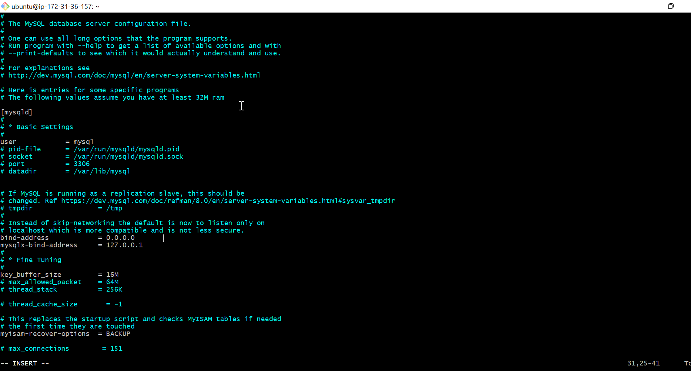

#               UNDERSTANDING CLIENT-SERVER ARCHITECTURE
##                  Client Server Architecture With MySQL

**What is Client-server architecture?**

Client-server refers to an Architecture in which two or more computers are connected over a network to send and receive request s between one and another. 

In their communication, each machine has its own role : The machine sending the request is referred to as the ***CLIENT** and the machine responding(serving) is referred to as the **SERVER**.

# IMPLEMENTING CLIENT-SERVER ARCHITECTURE USING MYSQL DATABASE MANAGEMENT SYSTEM (DBMS)

## To demonstrate basic client-server using MySQL RDBMS

**To create and configure two linux based Virtual servers(EC2 instances on AWS)**

Name the two servers: 
 - Server A name `MySQL-Server` for the serving machine
 - Server B name `MySQL-Client` for the requesting machine 

 

- Connect to the `MySQL-Server` and Install `MySQL software`


     -  Run `sudo apt install mysql-server` to install Mysql software .

     


- To install Mysql for the client server 

    - Run `sudo apt install mysql-client`

    


By default both EC2 virtual servers are located in the same local virtual network. so they can communicate with eachother using using local `IP address`

- To use `MySQL-server` local Ip address to connect from the client 

    - Change the inboud rule to TCP to port 3306 and connect to Clients `Private Ip address`

    

- To connect *Client* to *Server*, We need to configure `MySQL-Server` to allow connection from remote host.

    - Run `sudo vi /etc/mysql/mysql.conf.d/mysqld.cnf ` and change 
       

- To Run connect the *client-mysql* to the *Server-mysql* without using  `SSH`

    - Run the code below to create a user called `Client` and the user should be identified by a password `PassWord.2` on the `MySQL-Server`

    - Run `sudo mysql` to log in to the MYSQL console and paste the code below.

    

   - paste and exit
```
CREATE USER 'Clientes_user'@'%' IDENTIFIED BY 'PassWord.2';

```


- And grant permission to CLiente_user
```
GRANT ALL ON Cliente_database.* TO 'Clientes_user'@'%';
FLUSH PRIVILEGES;
```


- Then From the client server run `mysql -u Clientes_user -p -h 172.31.36.157`using the private Ip of the *Server


# END OF PROJECT


    

    
   


