# IMPLEMENTATION OF LOAD BALANCING WITH NGNIX

## Introduction to load Balancing and Nginx

**What is a load balancer?**

A load balancer distributes workloads across multiple compute resources, such as virtual servers. Using a load balancer increases the availability and fault tolerance of your applications.

You can add and remove compute resources from your load balancer as your needs change, without disrupting the overall flow of requests to your applications.

The load balancer stands in front of the webserver and all traffic gets into it first, it then distribute the traffic evenly across the set of webservers. This ensures no webserver gets overworked,consequently improving performance.

Nginx is a versatile software it acts like a webserver,reverse proxy, and a load balancer etc.All that is needed is to configure it properly to server to your use case.


## Prerequisite 
- EC2 Instance running on ubuntu 22.4

## STEP 1

- Open Aws management Console and click on EC2 instances to launch

    


- Under name provide a unique name for each of your Webserver. In this case `Load-balancer Apache` and `Load-balancer Apache`


    


    

- Under Application and Os images,click on quick start and Ubuntu 22.4

    


- Under key pair, click on create new key and use it for all the instances you provision. In this case we will create a key pair called `Universal-key`

    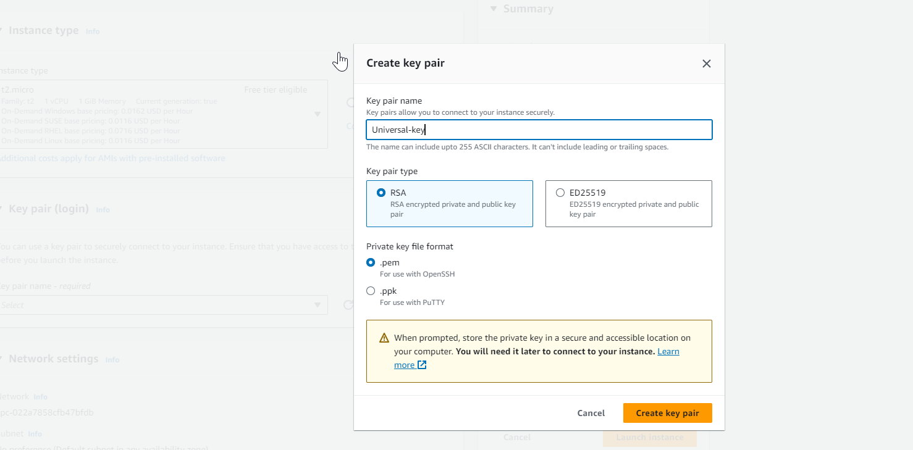

- Finally, click on Launch Instances

    


## STEP 2

Open Port 8000, we will be running our webservers on port 8000 while the load balancers run port 80. we will need to open port 8000 to allow traffic from anywhere. To do this we need to add a rule to the security group of each of our webserver.

- Click On the instance ID to get of your EC2 instances.

  - Load-balancer Apache

  

  - Load-balancer Apache-2

  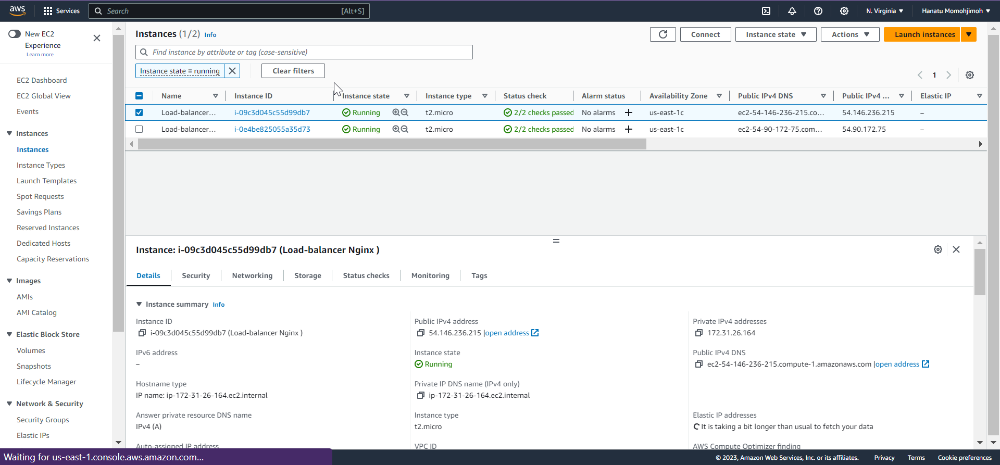

  - ON the same page scroll and click on `Security`

    - Load-balancer Apache-2

        

    - Load-balancer Apache 

        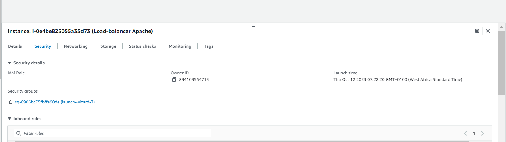

- Click on edit inbound rule.

    - Load-Balancer apache

         

    - Load-balancer Apache-2

        

- Add your rules; 

    - Load-Balancer Apache 

        

    - Load-Balancer Apache-2

         

## STEP 3

After provisioning both servers and openeing the necessary port,Install apache servers on both servers.

To do this we must first connect to the servers via ssh , so that we can run the installation command on the Terminals 

- To connect the instance, click the instance Id and Click connect.

    - Load-balancer APache 

        

    - Load balancer Apache 2

        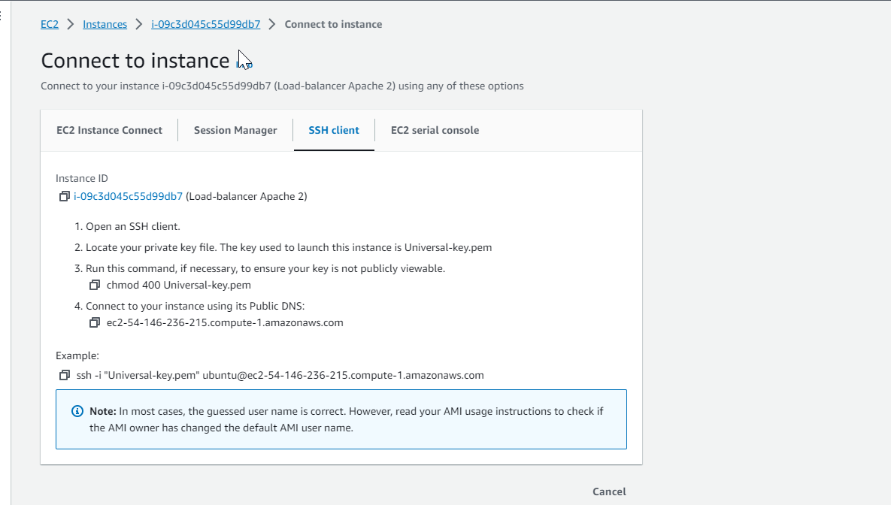

- Copy the `shh client` and cd into download in  your Terminal
- paste the shh Client and hit enter

    - Load-balancer Apache 
    

    - Load balancer Apache 2

    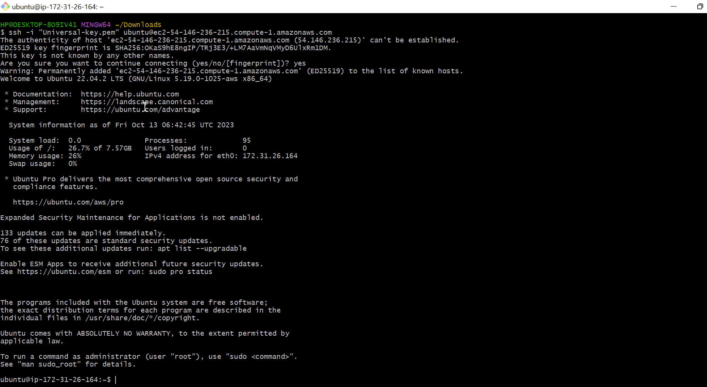

- To install Apache server Run `sudo apt update -y &&  sudo apt install apache2 -y`

    - Load-balancer Apache 

    

    - Load-balancer Apache 2

    


- To verify if Apache is running on the system
    - Run `sudo systemctl status apache2`

        - Load-balancer Apache 

        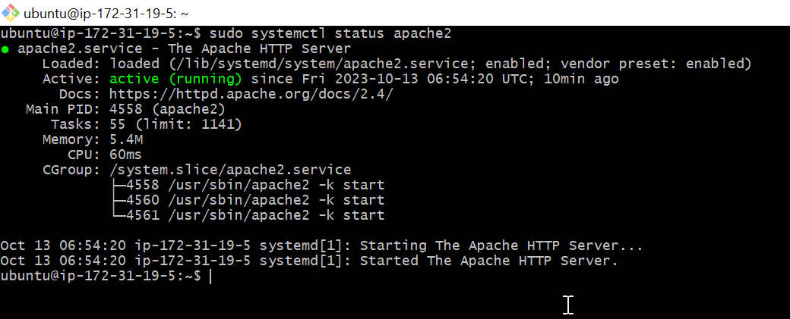

        - Load-balancer Apache2

        

## STEP 4
Configuring Apache webservers to serve content on port 8000 instead of the default port which is port 80.
Then we will create new `index.html` file. The file contain code to display the public Ip address of the Ec2 instances . We will then override apache webserver default html file with the new file

- To configure Apache to serve content on port 8000.
.
    - Run `sudo vi /etc/apache2/ports.conf ` and use text editor to open /etc/apache2/ports.config

        - Load-balancer Apache 
        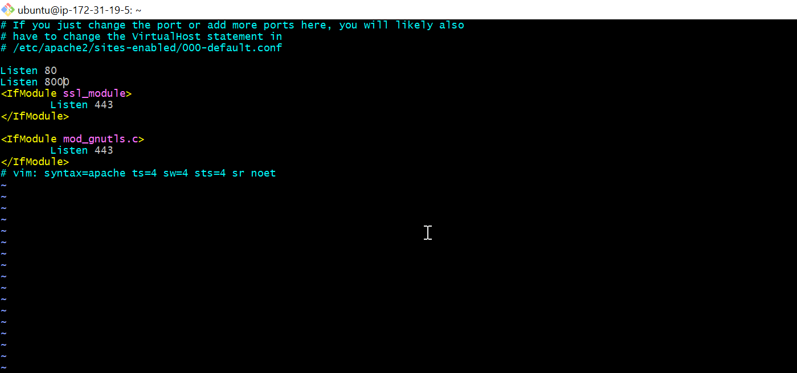

        - Load-balancer Apache2 

        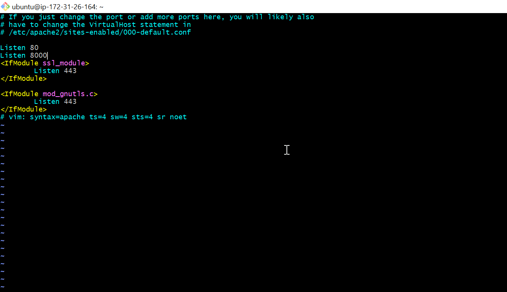


- To open the file `/etc/apache2/sites-available/000-default.conf` and change port;80 on the virtual host to port;8000.

    - Run `sudo vi /etc/apache2/sites-available/000-default.conf`

        - Load-balancer Apache 

            

        - Load-balancer Apache2 

           


- To Reload or Restart Apache to the new configuration using the command Below 

    - Run `sudo systemctl restart apache2`

        - Load-balancer Apache

            

        - Load-balancer Apache2

        


### Creatiing a new index.html file 

- To open a new index.html file 

 - Run `sudo vi index.html`

-  paste the code below and get the public Ip address to replace the placeholder text for Ip address in the html file.
```        <!DOCTYPE html>
        <html>
        <head>
            <title>My EC2 Instance</title>
        </head>
        <body>
            <h1>Welcome to my EC2 instance</h1>
            <p>Public IP:54.90.172.75</p>
        </body>
        </html>


```
- Load-balancer apache 

  

- Load-balancer apache2

.png>)


- To change the file ownership of index.html

    - Run `sudo chown www-data:www-data ./index.html`

        - Load-balancer apache

         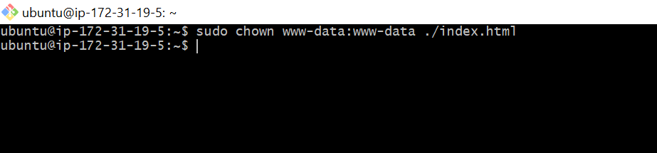  

        - Load-balancer apache2 

        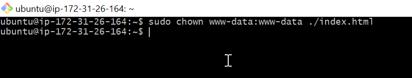

**Overriding the default HTML file of the apache webserver**

- To replace the the default html file with our new html 

    - Run `sudo cp -f ./index.html /var/www/html/index.html`

        - Load-balancer apache
        

        - Load-balancer apache2

        


- To restart webserver and laod new configuration 

    - Run `sudo systemctl restart apache2`

- RESULT on web browser

    - Load-balancer apache
        

    - Load-balancer apache2

        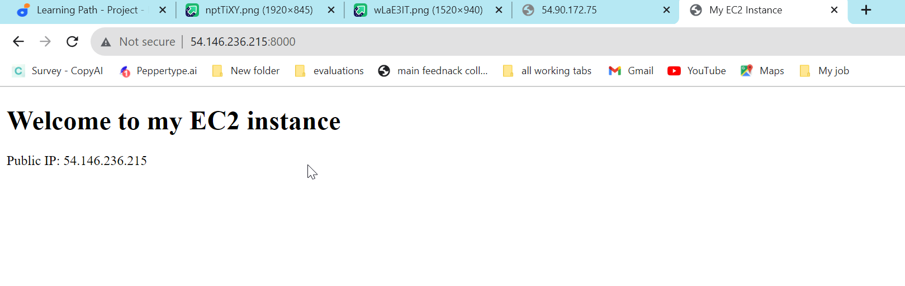

## STEP 5
**CONFIGURING NGINX AS LOAD BALANCER**
Prerequisite: 
- EC2 Instance running Ubuntu 22.4
- Port 80 open to allow trafic from anywhere
- SSH into the instance via the Terminal 

**INSTALLING NGINX**
- To Install Nginx Run `sudo apt update -y && sudo apt install nginx -y`

    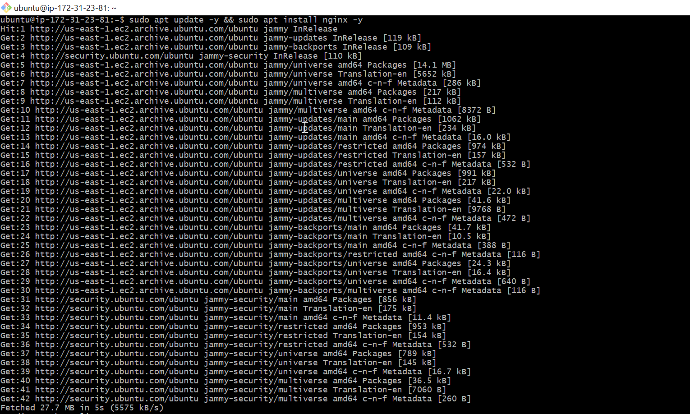

- TO Verify that Nginx is installed successfully 

    - Run `sudo systemctl status nginx`

       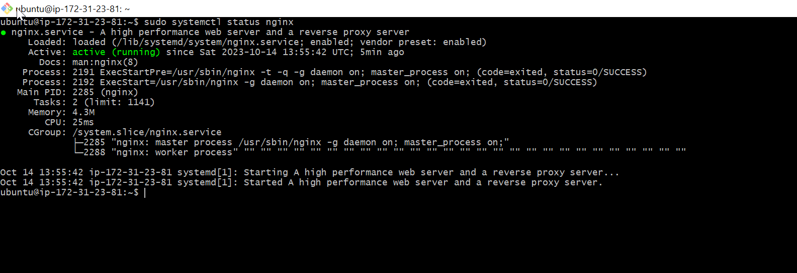

- Open a configuration file where you are going to paste the code for nginx to act as a `load-balancer`

    - Run `sudo vi /etc/nginx/conf.d/loadbalancer.conf`

    - Paste 
       ```        
        upstream backend_servers {

            # your are to replace the public IP and Port to that of your webservers
            server 127.0.0.1:8000; # public IP and port for webserser 1
            server 127.0.0.1:8000; # public IP and port for webserver 2

        }

        server {
            listen 80;
            server_name <your load balancer's public IP addres>; # provide your load balancers public IP address

            location / {
                proxy_pass http://backend_servers;
                proxy_set_header Host $host;
                proxy_set_header X-Real-IP $remote_addr;
                proxy_set_header X-Forwarded-For $proxy_add_x_forwarded_for;
            }
        }
    

       ```

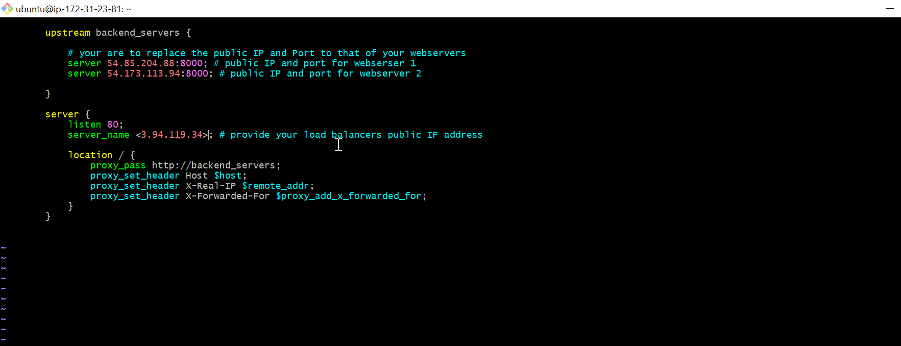


- **Upstream backend_servers :** Define a group of backend servers
- The *server* lines inside the *upstream* block list the addresses and the ports of your backend-servers.
- **Proxy_pass** inside the **location block** sets up the load balancing, passing the request to the backend servers.
- **The proxy_set_header** lines pass necessary header to the backend servers to correctly handled the request.

**TESTING CONFIGURATION**

- To test Configuration, Run `sudo nginx -t`

    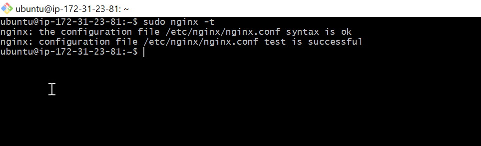

- To restart Nginx to load the configuration

    - Run `sudo systemctl restart nginx`

        

- In the web browser  paste the `Ip-address` of the Nginx load paste and hit enter
- RESULT
 
    - Load-balancer apcahe 
        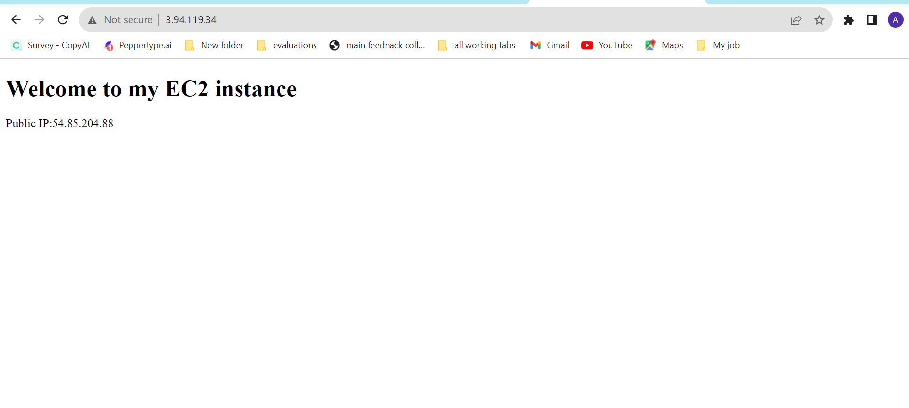

    - Load-balancer apache2
    
    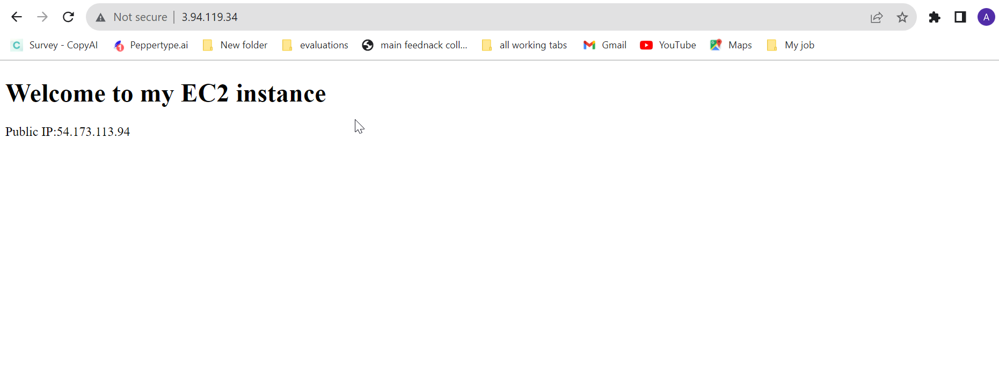


# END OF PROJECT 7


  
   

  


