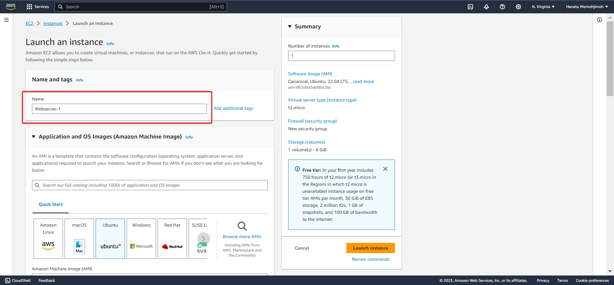
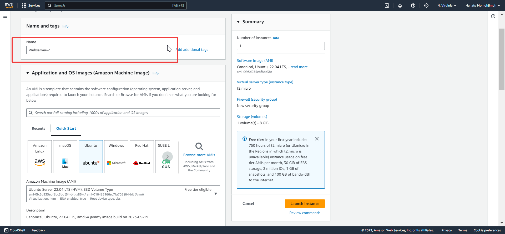
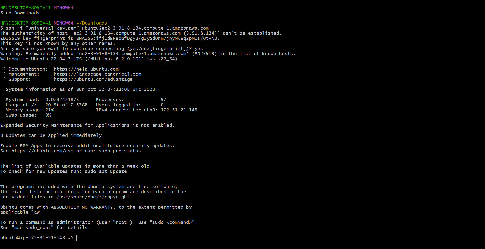
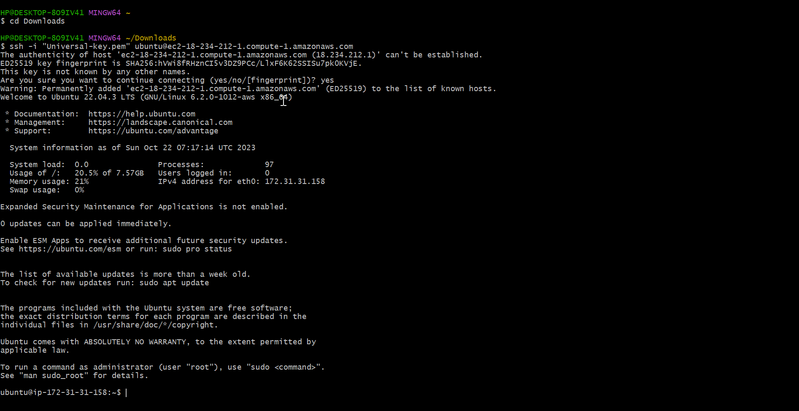
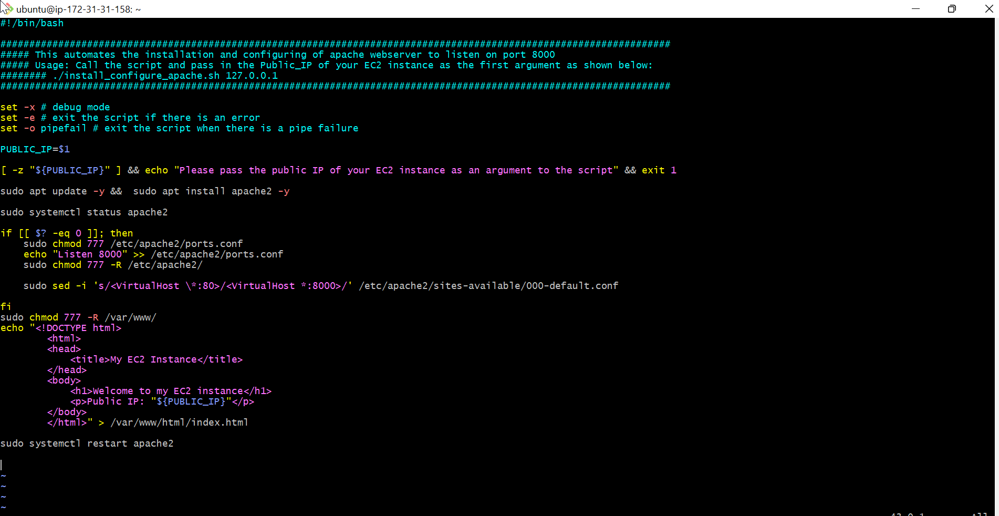
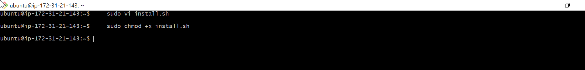
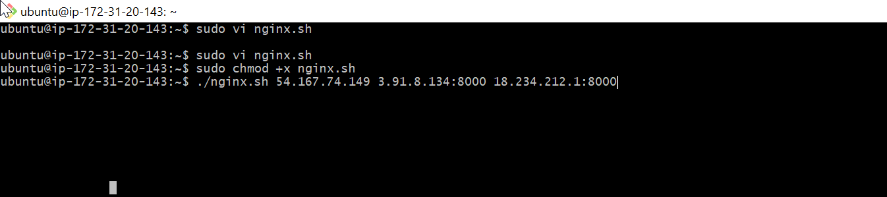

# AUTOMATING LOAD-BALANCER CONFIGURATION WITH SHELL SCRIPTING 

As DevOps Engineer, automation is the core of our responsibility. Automation  helps speed up deployment of services and reduces the chances of error in everyday activities in the CI/CD process.

## Prerequisite ;
- Two EC2 instances 
- Installing apache webserver on both virtual machine 
- Insatlling Nginx-load balancer on a virtual machine.


## Deploying and Configuring the Webservers 

- To Install and configure the webserver;
    - First Provision two EC2 Instances, In this case `Webserver-1` and `Webserver-2` respectively 
    - Open `port 8000` to allow traffic from anywhere.

    - Webserver-1
      

    - Webserver-2 
      


- To open `Port 800` on the security group

  - 


- Connect both virtual servers to Terminal via `ssh`
    - `cd` into Downloads where the `ssh key` is located
    - Copy the ssh client and paste on the terminal.

- Webserver-1 Terminal


- Webserver-2 Terminal 



**To deploy and run the webservers**

- Open a file name `install.sh` using Vi-editor 
- Run `sudo vi install.sh`

- paste the following script

```
#!/bin/bash

####################################################################################################################
##### This automates the installation and configuring of apache webserver to listen on port 8000
##### Usage: Call the script and pass in the Public_IP of your EC2 instance as the first argument as shown below:
######## ./install_configure_apache.sh 127.0.0.1
####################################################################################################################

set -x # debug mode
set -e # exit the script if there is an error
set -o pipefail # exit the script when there is a pipe failure

PUBLIC_IP=$1

[ -z "${PUBLIC_IP}" ] && echo "Please pass the public IP of your EC2 instance as an argument to the script" && exit 1

sudo apt update -y &&  sudo apt install apache2 -y

sudo systemctl status apache2

if [[ $? -eq 0 ]]; then
    sudo chmod 777 /etc/apache2/ports.conf
    echo "Listen 8000" >> /etc/apache2/ports.conf
    sudo chmod 777 -R /etc/apache2/

    sudo sed -i 's/<VirtualHost \*:80>/<VirtualHost *:8000>/' /etc/apache2/sites-available/000-default.conf

fi
sudo chmod 777 -R /var/www/
echo "<!DOCTYPE html>
        <html>
        <head>
            <title>My EC2 Instance</title>
        </head>
        <body>
            <h1>Welcome to my EC2 instance</h1>
            <p>Public IP: "${PUBLIC_IP}"</p>
        </body>
        </html>" > /var/www/html/index.html

sudo systemctl restart apache2


```
- Webserver-1
    

- Webserver-2
    

- To save and exit the text editor,  Run `ESCAPE KEY + :wq! + ENTER-KEY`

- To change permission on the file to make executable

    - Run `sudo chmod +x install.sh`

    - Webserver-1
        

    - Webserver-2
        

- To run the script
- Run `./install.sh PUBLIC_IP`

- ie. for Webserver-1, Run `./install.sh 3.91.8.134`

    

- For webserver-2, Run `./install.sh 18.234.212.1`

   


## DEPLOYING AND CONFIGURING NGINX LOAD BALANCER 

- Launch an EC2 Instance on Ubuntu 22.4 distribution 

    


**STEPS TO RUN THE SHELL SCRIPT**


- Connect Ec2  Instance to Terminal using Ssh client 
    

- Open a file `nginx.sh` by running `sudo vi nginx.sh`

    

- Copy and paste the code below 
```
#!/bin/bash

######################################################################################################################
##### This automates the configuration of Nginx to act as a load balancer
##### Usage: The script is called with 3 command line arguments. The public IP of the EC2 instance where Nginx is installed
##### the webserver urls for which the load balancer distributes traffic. An example of how to call the script is shown below:
##### ./configure_nginx_loadbalancer.sh PUBLIC_IP Webserver-1 Webserver-2
#####  ./configure_nginx_loadbalancer.sh 54.167.74.149 3.91.8.134:8000  18.234.212.1:8000
############################################################################################################# 

PUBLIC_IP=$1
firstWebserver=$2
secondWebserver=$3

[ -z "${PUBLIC_IP}" ] && echo "Please pass the Public IP of your EC2 instance as the argument to the script" && exit 1

[ -z "${firstWebserver}" ] && echo "Please pass the Public IP together with its port number in this format: 127.0.0.1:8000 as the second argument to the script" && exit 1

[ -z "${secondWebserver}" ] && echo "Please pass the Public IP together with its port number in this format: 127.0.0.1:8000 as the third argument to the script" && exit 1

set -x # debug mode
set -e # exit the script if there is an error
set -o pipefail # exit the script when there is a pipe failure


sudo apt update -y && sudo apt install nginx -y
sudo systemctl status nginx

if [[ $? -eq 0 ]]; then
    sudo touch /etc/nginx/conf.d/loadbalancer.conf

    sudo chmod 777 /etc/nginx/conf.d/loadbalancer.conf
    sudo chmod 777 -R /etc/nginx/

    
    echo " upstream backend_servers {

            # your are to replace the public IP and Port to that of your webservers
            server  "${firstWebserver}"; # public IP and port for webserser 1
            server "${secondWebserver}"; # public IP and port for webserver 2

            }

           server {
            listen 80;
            server_name "${PUBLIC_IP}";

            location / {
                proxy_pass http://backend_servers;   
            }
    } " > /etc/nginx/conf.d/loadbalancer.conf
fi

sudo nginx -t

sudo systemctl restart nginx


```


- To save and quit the editor, Run ` ESCAPE-KEY  + :wq! + ENTER-KEY `

- To change the file permission and make it an executable file

    - Run `sudo chmod +x nginx.sh`

    

- To execute the script

    - Run `./nginx.sh PUBLIC_IP Webserver-1 Webserver-2`
    - i.e `./nginx.sh 54.167.74.149 3.91.8.134:8000  18.234.212.1:8000`

        

- Result

    


## VERIFYING THE SET UP

- Webserver-1 `Ip-3.91.8.134:8000`
    


- Webserver-2 `Ip-18.234.212.1:8000`

    

- Nginx-Laod balancer `Ip-54.167.74.149`

   

   


# END OF PROJECT


